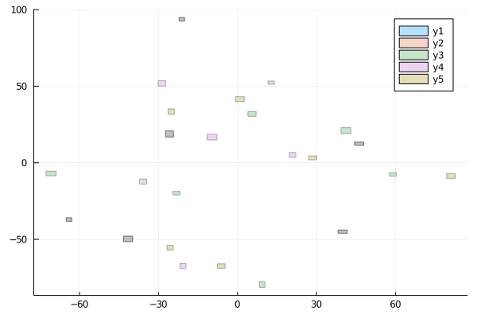

# Introdução

Neste projeto é realizada a modelagem, execução e posterior análise do problema proposto em  https://ieeexplore.ieee.org/abstract/document/6629989 .

Para tanto, são seguidos os seguintes passos:
1. Primeiramente são gerados os dados, que diferentemente do descrito no artigo, são gerados artificialmente: 
    1. $n$ grupos de retângulos, para $n \in [3,7]$ ($n$ é retirado de uma distrubuição uniforme em $[3,7]$);
    2. cada grupo contando com $k$ retângulos, com $k \in [5,15]$ ($k$ é retirado de uma distrubuição uniforme em $[5,15]$)
    3. cada retângulo tem uma altura e comprimento em $[2,4]$ (também, retirado de uma distribuição uniforme)
2. Depois de uma breve discussão quanto ao modelo usado, os retângulos têm suas posições alteradas, de forma a minimizar sobreposição, enquanto mantém a estrutura de vizinhança;
3. Diversos métodos de otimização são utilizados, e seus resultados em termos de resultado obtido e tempo de execução são então comparados.

Depois de uma primeira execução, com breve discussão, os passos são repetidos diversas vezes, para se obter execuções com valores diferentes, afim de obtermos uma ideia melhor dos desempenhos dos métodos de otimização usados.

Os trechos de códigos utilizados para tal execução são apresentados, com uma breve explicação.

Primeiro, adiciona-se as bibliotecas a serem usadas:


```julia
using Pkg
import Distributions: Uniform, MvNormal, Product
using Plots
using GraphRecipes
using GraphPlot
using LightGraphs
using LinearAlgebra
using SparseArrays
using PyCall
using PyCallUtils
using ForwardDiff
using Optim
using LineSearches
```

Gera-se a quantidade de grupos aleatórios e de pontos por grupo


```julia
gera_n_groups_points() = (rand(3:7), rand(5:15))

(n_groups, n_points) = gera_n_groups_points()

print("Grupos: $(n_groups), pontos por grupo: $(n_points)")
```

    Grupos: 4, pontos por grupo: 6

Gera e apresenta os centors dos grupos, cujas posições estão entre $(-15,-15)$ e $(10,10)$:


```julia
min, max = -15, 10
centers = [rand(Uniform(min,max),2) for i in 1:n_groups]

scatter([point[1] for point in centers], 
        [point[2] for point in centers])
```


Gera e apresenta os pontos em cada grupo:


```julia
points = [rand(MvNormal(ci, I), n_points) for ci in centers]

# Do this in order to initialize plt variable
group = points[1]
plt = scatter([col[1] for col in eachcol(group)], 
              [col[2] for col in eachcol(group)])

for group in points[2:end]
	plt = scatter!(plt, [col[1] for col in eachcol(group)], 
                        [col[2] for col in eachcol(group)])
end
display(plt)
```


Define as alturas e comprimentos dos retângulos, e os apresenta:


```julia
height_width = [rand(Product(Uniform.([2,2], [4,4])), n_points) for g in 1:n_groups]

rectangle(wh, xy) = Shape(xy[1] .+ [0,wh[1],wh[1],0], xy[2] .+ [0,0,wh[2],wh[2]])

function draw_grouped_rectangles(points, height_width)

    groupp  = points[1]
    sizes   = height_width[1]
    plt = plot([rectangle(hw, xy) for (hw, xy) in zip(eachcol(sizes), eachcol(groupp))], 
               opacity = .3)

    for (group, size)  in zip(points, height_width)
        plt = plot!(plt,
                    [rectangle(hw, xy) for (hw, xy) in zip(eachcol(size), eachcol(group))], 
                    opacity = .3)
    end
    display(plt)
end


draw_grouped_rectangles(points, height_width)
```


### Modelagem Matemática:
Para atingirmos os objetivos delineados na introdução, buscamos minimizar a "função energia":

$$
E = (1-\alpha)E_o + \alpha E_N,\\
$$
para $\alpha \in (0,1)$, onde $E_o$ é referente à taxa de sobreposição dos retângulos e $E_N$ a quanto a solução obtida distorce a estrutura de vizinhança original dos dados. Mais precisamente, temos

$$
E_o = \frac{2}{n(n+1)} \sum_{i=1}^n\sum_{j=1}^n [O_{ij}(x,h)O_{ij}(y,v)]\\
$$

onde

$$
O_{ij}(x,h) = \left\{ 
    \begin{array}\\
        \frac{1}{h_j^4} [h_j^2 - (x_i - x_j)^2]_+,\quad \textrm{se} \quad  & x_i \ge x_j\\
        \frac{1}{h_i^4} [h_i^2 - (x_i - x_j)^2]_+,\quad \textrm{se} \quad & x_i < x_j
    \end{array}
\right.
$$

e

$$
E_N = \frac{n^2}{2(\|\delta_x\|^2 + \|\delta_y\|^2)} \left(\|Lx - \omega\delta_x\|^2 + \|Ly - \omega\delta_y\|^2\right)
$$

onde

$$
\delta_x = Lx^0, \quad \textrm{e} \quad \delta_y = Ly^0
$$

sendo

$$
L_{ij} = \left\{ 
    \begin{array}\\
        \frac{-1}{|i|}, &\mbox{se } j \neq i \\
        1, & \mbox{se }  i = j\\
        0, & \mbox{caso contrário.}
    \end{array}
\right.
$$


As implementações dessas funções são dadas a seguir.


```julia
x₊(x) = x ≥ 0 ? x : 0

Oᵢⱼ(i, j, x, h) = x[i] ≥ x[j] ? x₊( h[j]^2 - (x[i] - x[j])^2 )^2 / h[j]^4 : 
                                x₊( h[i]^2 - (x[i] - x[j])^2 )^2 / h[i]^4
 
function Eₒ(xy, h, w)
    n = size(xy)[2]
    
    x = xy[1:2:end]
    y = xy[2:2:end]  
    retval = 0
    
    for i in 1:n     
        for j in (i + 1):n
            retval +=  Oᵢⱼ(i, j, x, h) *  Oᵢⱼ(i, j, y, w)
        end
    end 
    return 2 * retval / (n * (n + 1))
end
```


    Eₒ (generic function with 1 method)


### Constrói grafo direcionado conexo a partir dos grupos


```julia
# A ser usado mais depois, para regrupamento dos pontos
regroup(M, n_groups = n_groups, n_points = n_points) = 
    [M[:,(i*n_points+1):(i+1)*n_points] for i in 0:(n_groups-1)]

# Transforma "points" em um Array 2x(n_groups⋅n_points)
function disgroup(points)
    lop = points[1]
    for g in points[2:end] 
        lop = [lop g] 
    end
    return lop
end
lop = disgroup(points)

# Serão usados adiante
h = disgroup(height_width)[2,:]
w = disgroup(height_width)[1,:]

# Para termos a função python "connected_knn" no "caminho"
pushfirst!(PyVector(pyimport("sys")."path"), pwd())
connected_knn = pyimport("connected_knn")

# Cria grafo conexo de vizinhança por meio de knn
graph = connected_knn.connected_knn(transpose(lop), extra_neighbors = 1)

# Converte o resultado ao tipo Julia SparseMatrixCSC, e então o mostra
graph = convert(SparseMatrixCSC,graph)
graphplot(graph, 
          markercolor = range(HSV(0,1,1), stop=HSV(-360,1,1)), 
          names = 1:(n_groups*n_points),
          linecolor = :darkgrey,
          linealpha = .2,
          node_size = .2)
```


### Constrói matriz L


```julia
# Obtém um "objeto" do tipo Graph
G = Graph(graph)

# Obtém uma lista de graus para os vérticesGets a list of degrees for the vertices
deg = degree(G)

L = sparse(1.0I, size(G)[1], size(G)[2])
for i in 1:size(G)[1]
    for j in (i+1):size(G)[2]
        L[i,j] = (graph[i,j] ≠ 0 && (j ≠ i)) ? (-1/deg[i]) : 0.0
        L[j,i] = L[i,j]
    end
end

# Vizualização da matriz, para nos certificarmos de que está correto
spy(L)
```


```julia
x₀ = lop[1,:]
y₀ = lop[2,:]

δx = L*x₀
δy = L*y₀

function Eₙ(xy, ω)
    x = xy[1,:]
    y = xy[2,:]

    n = size(x)[1]
 
    retval = norm(L*x - ω*δx)^2 + norm(L*y - ω*δy)^2
    return n^2 * retval / (2 * (norm(δx)^2 + norm(δy)^2 ))
end
```


    Eₙ (generic function with 1 method)


### Otimização

Agora que as funções e o objetivo estão bem definidos, realizamos a otimização de $E$, como dito anteriormente.

Para tanto, existem diversas opções. Aqui, será utilizada a função ```Optim.optimize``` do pacote ```Optim``` (adicionado anteriormente). Quando o método de otimização necessitar da derivada da função, é utilizada a opção ```autodiff = :forward```, que obtém o gradiente da função automáticamente usando o ```ForwardDiff```.

Primeiramente são mostrados resultados preliminares, e então são feitas comparações com os diferentes métodos e opções disponíveis.


```julia
LBFGShz = LBFGS(linesearch = HagerZhang())

function E(xy, α, ω)
    (1-α)*Eₒ(xy, h, w) + α*Eₙ(xy, ω)
end
```


    E (generic function with 1 method)


#### Podemos ver que, como esperado, para $\alpha = 0$, toda a estrutura de vizinhança é perdida:


```julia
ω = 2
α = 0

function E2(xyω)
    xy = xyω[:,1:(end-1)]
    ω  = xyω[1,end]
    (1-α)*Eₒ(xy, h, w) + α*Eₙ(xy, ω)
end
lom = [lop [ω, ω]]

res = Optim.optimize(E2, lom, LBFGShz, autodiff = :forward)
Gmin = regroup(res.minimizer[:,1:(end-1)])

draw_grouped_rectangles(Gmin, height_width)
```





#### E, também como esperado, para $\alpha = 1$, obtemos o mesmo resultado inicial


```julia
ω = 2
α = 1

function E2(xyω)
    xy = xyω[:,1:(end-1)]
    ω  = xyω[1,end]
    (1-α)*Eₒ(xy, h, w) + α*Eₙ(xy, ω)
end

lom = [lop [ω, ω]]

resOne = Optim.optimize(E2, lom, LBFGShz, autodiff = :forward)
Gmin = regroup(resOne.minimizer[:,1:(end-1)])

draw_grouped_rectangles(Gmin, height_width)
```


#### Mas para $\alpha = 0,5$  já obtemos uma separação mais pronunciada:

Dependendo do grupo, pode ser necessário um $\alpha$ maior ou menor. Para alguns grupos, $\alpha = 0,5$ é bom o suficiente, para outros não. Note que é adicionado um grande espaço entre os grupos. Isso poderia ser diminuido com alguma técnica de $ \textit{seam carving}$, por exemplo, mas como não diz respeito ao problema de otimização propriamente, não tocaremos nesse tópico. 


```julia
ω = 2
α = .5

function E2(xyω)
    xy = xyω[:,1:(end-1)]
    ω  = xyω[1,end]
    (1-α)*Eₒ(xy, h, w) + α*Eₙ(xy, ω)
end
lom = [lop [ω, ω]]

resHalf = Optim.optimize(E2, lom, LBFGShz, autodiff = :forward)
Gmin = regroup(resHalf.minimizer[:,1:(end-1)])

draw_grouped_rectangles(Gmin, height_width)
```


### Breve descrição e comparação dos resultados dos métodos

A seguir é realizada a execução e posterior comparação de diversos métodos de otimização para o problema discutido. Em particular, são executados:

1. LBFGS ("limited memory BFGS") com busca linear de Hager Zhang (como exposto no artigo $\textit{W. W. Hager and H. Zhang (2006) Algorithm 851: CG_DESCENT, a conjugate gradient method with guaranteed descent}$)
2. LBFGS com busca linear de Armijo (StrongWolfe, com o parâmetro c_1 = 1e-4)
3. "Descida por gradiente" com busca linear de Hager Zhang 
4. "Descida por gradiente" com busca linear de Armijo, como discutido em aula
5. "Descida por gradiente com momento" e
6. "Simmulated annealing"

No método BFGS (_Broyden–Fletcher–Goldfarb–Shanno_) é um método iterativo para a resolução de problemas de otimização, preferencialmente sobre funções duplamente diferenciáveis (apesar de também poder apresentar performance boa mesmo para problemas não suaves). É um método do tipo _quase-newton_, incorrendo no cálculo de aproximação da Hessiana da função objetivo, sendo, entre esses, um dos métodos mais populares. Neste método, a direção de busca é calculada como $B_k p_k = - \nabla f(x_k)$, onde $B_k$ é uma aproximação da Hessiana. Uma busca linear é realizada na direção $p_k$ é então usada para encontrar $x_{k+1}$, minimizando $f(x_k + \gamma p_k)$, com $\gamma > 0$. A $B_{k+1}$ é aproximada como:

$$
B_{k+1} = B_k + \frac{y_k y_k^T}{(y_k,s_k)} + \frac{B_k s_k s_k^T B_k^T}{s_k^T B_k s_k}
$$

onde $y_k = \nabla f(x_{k+1}) - \nabla f(x_k)$ e $s_k = x_{k+1} - x_k$.

O método LBFGS (algoritmo _Limited Broyden–Fletcher–Goldfarb–Shanno_) é similar ao BFGS, exceto que, enquanto no BFGS é calculada uma aproximação à Hessiana como uma matriz densa, no LBFGS apenas alguns vetores são armazenados, e a aproximação é representada implicitamente, tornando-o adequado para problemas com muitas variáveis.

No método de "Descida por gradiente com momento", é adicionado um $\gamma \in (0,1)$ em $x_{n+1} =\gamma x_n − \eta \nabla f(xn)$.

O método de Nelder Smead aqui usado é baseado na implementação de _Nelder and Mead (1965)_ e _Gao and Han (2010)_. Ele é o método padrão que _Optim_ utiliza para minimização quando o usuário não indica que outro deve ser usado. É um método que não faz uso do gradiente da função objetico (sendo, assim, especialmente adequado para quando tal função não é diferenciável) e é um método de busca direta. Ele mantém um registro de um simplexo (isto é, uma quantidade de pontos que gera um simplexo no espaço do problema) e, a cada iteração, o atualiza segundo uma de quatro operações reflexão, expansão, contração ou encolhimento, o objetivo sendo iterativamente trocar o pior ponto do simplexo por um ponto melhor (o valor minimizante retornado é ou um dos pontos, ou o centroide do simplexo).

$\textit{Simmulated annealing}$ é um algorítmo probabilistico, baseado no algorítmo de Metropolis-Hastings, para encontrar o mínimo de uma função, mais frequentemente sobre domínios grandes. Ele foi adicionado aqui mais como um "problema teste", sendo um método não adequado ao problema considerado. Nota-se que, para esse método, foi utilizado um limite de iterações 10 vezes maior do que para os demais métodos, porque cada iteração dele é muito rápida, e manter o mesmo limite de iterações dificultaria a análise do tempo levado para os demais métodos - mas os valores mínimos obtidos por esse método foram excepcionalmente ruins, como visto adiante.


São executadas 6 iterações, a fim de fazer uma análise do desempenho de cada método para diferentes casos. Assim, a cada iteração são gerados dados diferentes e cada um dos algoritmos é executado nesses dados. Todas as execuções são com $\alpha = 0,5$ e $\omega = 2$.


```julia
vezes = 6

# Limites para centros dos grupos
min, max = -15, 10

LBFGShz = LBFGS(linesearch = HagerZhang())
LBFGSsw = LBFGS(linesearch = StrongWolfe(c_1 = 1e-4))
BFGShz  = BFGS(linesearch = HagerZhang())
BFGSsw  = BFGS(linesearch = StrongWolfe(c_1 = 1e-4))

NEWThz  = Newton(linesearch = HagerZhang())
GRADhz  = GradientDescent(linesearch = HagerZhang())
GRADsw  = GradientDescent(linesearch = StrongWolfe(c_1 = 1e-4))
MGRAD   = MomentumGradientDescent()

SIMA    = SimulatedAnnealing()
NMEAD   = NelderMead()

methods = [LBFGShz LBFGSsw BFGShz BFGSsw GRADhz GRADsw MGRAD SIMA NMEAD]

ω = 2
α = .5

results = []
time    = []
for t in 1:vezes
    (n_groups, n_points) = gera_n_groups_points()

    centers = [rand(Uniform(min,max),2) for i in 1:n_groups]
    points = [rand(MvNormal(ci, I), n_points) for ci in centers]
    height_width = [rand(Product(Uniform.([2,2], [4,4])), n_points) for g in 1:n_groups]

    lop = disgroup(points)

    h = disgroup(height_width)[2,:]
    w = disgroup(height_width)[1,:]

    graph = convert(SparseMatrixCSC, connected_knn.connected_knn(transpose(lop), extra_neighbors = 1))

    # Obtém um "objeto" do tipo Graph
    G = Graph(graph)

    # Obtém uma lista de graus para os vérticesGets a list of degrees for the vertices
    deg = degree(G)

    # Constrói matriz L
    L = sparse(1.0I, size(G)[1], size(G)[2])
    for i in 1:size(G)[1]
        for j in (i+1):size(G)[2]
            L[i,j] = (graph[i,j] ≠ 0 && (j ≠ i)) ? (-1/deg[i]) : 0.0
            L[j,i] = L[i,j]
        end
    end

    # Define Eₙ
    x₀ = lop[1,:]
    y₀ = lop[2,:]

    δx = L*x₀
    δy = L*y₀

    function Eₙ(xy, ω)
        x = xy[1,:]
        y = xy[2,:]

        n = size(x)[1]

        retval = norm(L*x - ω*δx)^2 + norm(L*y - ω*δy)^2
        return n^2 * retval / (2 * (norm(δx)^2 + norm(δy)^2 ))
    end

    function E(xy, α, ω)
        (1-α)*Eₒ(xy, h, w) + α*Eₙ(xy, ω)
    end
    
    function E2(xyω)
        xy = xyω[:,1:(end-1)]
        ω  = xyω[1,end]
        (1-α)*Eₒ(xy, h, w) + α*Eₙ(xy, ω)
    end
    lom = [lop [ω, ω]]
    
    
    print("Rodada $(t):\n")
    
    append!(results, [@time Optim.optimize(E2, lom, m, autodiff = :forward, 
                                           Optim.Options(iterations = (m == SIMA ? 20000 : 2000)))
                      for m in methods])
    
    print('\n')
    
    append!(results, [@time Optim.optimize(E2, lom, m, 
                                       Optim.Options(iterations = (m == SIMA ? 20000 : 2000))) 
                  for m in methods[1:(end-2)]])


    print("\n \n")

end
```

     20.751744 seconds (253.70 M allocations: 15.291 GiB, 14.56% gc time)
      9.167008 seconds (95.41 M allocations: 6.463 GiB, 15.28% gc time)
      2.214536 seconds (9.49 M allocations: 674.322 MiB, 16.84% gc time)
      2.364701 seconds (8.77 M allocations: 635.135 MiB, 16.06% gc time)
     29.863241 seconds (286.36 M allocations: 22.044 GiB, 17.74% gc time)
     13.269886 seconds (123.64 M allocations: 9.528 GiB, 17.30% gc time)
     36.799683 seconds (347.29 M allocations: 26.709 GiB, 17.83% gc time)
      3.231912 seconds (660.05 k allocations: 118.419 MiB, 1.22% gc time)
      0.479683 seconds (96.46 k allocations: 16.631 MiB)
    
    189.576282 seconds (42.01 M allocations: 7.155 GiB, 1.06% gc time)
     69.113822 seconds (15.17 M allocations: 2.616 GiB, 1.04% gc time)
     15.687052 seconds (1.54 M allocations: 271.552 MiB, 1.41% gc time)
     16.501413 seconds (1.42 M allocations: 249.149 MiB, 1.31% gc time)
    211.848219 seconds (46.23 M allocations: 7.983 GiB, 1.05% gc time)
     99.173464 seconds (22.12 M allocations: 3.819 GiB, 1.05% gc time)
    252.517024 seconds (55.57 M allocations: 9.598 GiB, 1.04% gc time)
    
     
     42.499759 seconds (494.25 M allocations: 32.533 GiB, 15.88% gc time)
     19.547066 seconds (183.72 M allocations: 15.241 GiB, 17.56% gc time)
      4.666272 seconds (22.54 M allocations: 1.580 GiB, 19.70% gc time)
      5.810105 seconds (20.91 M allocations: 1.511 GiB, 17.32% gc time)
     55.889256 seconds (547.75 M allocations: 47.579 GiB, 18.71% gc time)
     29.300814 seconds (272.70 M allocations: 23.706 GiB, 17.99% gc time)
     74.469686 seconds (694.01 M allocations: 60.135 GiB, 18.53% gc time)
      4.963339 seconds (660.05 k allocations: 137.341 MiB, 0.73% gc time)
      0.766959 seconds (93.88 k allocations: 18.790 MiB)
    
    371.915728 seconds (51.73 M allocations: 10.352 GiB, 0.78% gc time)
    139.533785 seconds (19.36 M allocations: 3.875 GiB, 0.75% gc time)
     31.783878 seconds (2.58 M allocations: 529.093 MiB, 0.73% gc time)
     31.034289 seconds (2.27 M allocations: 464.984 MiB, 1.01% gc time)
    429.294431 seconds (57.48 M allocations: 11.513 GiB, 0.79% gc time)
    212.385940 seconds (28.40 M allocations: 5.687 GiB, 0.79% gc time)
    481.368514 seconds (70.89 M allocations: 14.199 GiB, 0.76% gc time)
    
     
      1.990707 seconds (19.83 M allocations: 1.337 GiB, 10.59% gc time)
      1.523692 seconds (16.54 M allocations: 1.143 GiB, 12.18% gc time)
      0.121826 seconds (1.19 M allocations: 102.334 MiB, 22.17% gc time)
      0.101081 seconds (1.04 M allocations: 93.903 MiB, 11.86% gc time)
      4.490757 seconds (43.18 M allocations: 4.571 GiB, 19.41% gc time)
      2.788222 seconds (25.45 M allocations: 2.695 GiB, 18.29% gc time)
      5.953635 seconds (58.63 M allocations: 6.130 GiB, 19.46% gc time)
      1.001250 seconds (660.05 k allocations: 75.080 MiB, 1.73% gc time)
      0.162906 seconds (105.52 k allocations: 11.556 MiB)
    
     32.518794 seconds (23.50 M allocations: 2.571 GiB, 2.01% gc time)
     11.889231 seconds (8.65 M allocations: 969.116 MiB, 1.96% gc time)
      0.893202 seconds (626.22 k allocations: 70.235 MiB, 2.02% gc time)
      0.752296 seconds (546.96 k allocations: 61.262 MiB, 2.20% gc time)
     31.566700 seconds (22.75 M allocations: 2.492 GiB, 2.07% gc time)
     18.030709 seconds (13.16 M allocations: 1.442 GiB, 1.94% gc time)
     42.816436 seconds (31.21 M allocations: 3.419 GiB, 2.05% gc time)
    
     
      8.449145 seconds (116.58 M allocations: 7.047 GiB, 13.84% gc time)
      3.803995 seconds (48.33 M allocations: 2.895 GiB, 12.58% gc time)
      0.382367 seconds (4.51 M allocations: 340.908 MiB, 16.30% gc time)
      0.358810 seconds (3.89 M allocations: 305.769 MiB, 14.44% gc time)
     13.963704 seconds (146.91 M allocations: 13.290 GiB, 18.66% gc time)
      7.028663 seconds (70.82 M allocations: 6.411 GiB, 17.65% gc time)
     17.137670 seconds (180.34 M allocations: 16.276 GiB, 18.61% gc time)
      2.006945 seconds (660.05 k allocations: 97.055 MiB, 1.46% gc time)
      0.308250 seconds (100.51 k allocations: 14.210 MiB)
    
     78.202409 seconds (27.72 M allocations: 3.920 GiB, 1.28% gc time)
     35.697920 seconds (12.57 M allocations: 1.778 GiB, 1.32% gc time)
      3.353608 seconds (1.17 M allocations: 169.951 MiB, 1.07% gc time)
      2.867787 seconds (1.01 M allocations: 145.578 MiB, 1.29% gc time)
    106.139408 seconds (37.78 M allocations: 5.349 GiB, 1.29% gc time)
     48.647573 seconds (17.35 M allocations: 2.456 GiB, 1.28% gc time)
    132.581257 seconds (47.05 M allocations: 6.662 GiB, 1.29% gc time)
    
     
     72.804673 seconds (965.01 M allocations: 58.528 GiB, 15.56% gc time)
     29.851404 seconds (360.94 M allocations: 23.791 GiB, 16.00% gc time)
     10.643872 seconds (55.40 M allocations: 3.472 GiB, 18.86% gc time)
     12.208583 seconds (55.41 M allocations: 3.478 GiB, 18.38% gc time)
    100.851919 seconds (1.22 G allocations: 84.324 GiB, 17.15% gc time)
     41.857517 seconds (496.67 M allocations: 34.345 GiB, 16.64% gc time)
    110.008856 seconds (1.34 G allocations: 92.624 GiB, 17.16% gc time)
      7.513104 seconds (660.05 k allocations: 173.050 MiB, 0.63% gc time)
      1.130854 seconds (91.17 k allocations: 23.014 MiB)
    
    729.928225 seconds (66.50 M allocations: 16.769 GiB, 0.57% gc time)
    269.259533 seconds (24.64 M allocations: 6.213 GiB, 0.58% gc time)
     58.006256 seconds (3.81 M allocations: 984.244 MiB, 0.65% gc time)
     68.328554 seconds (4.32 M allocations: 1.088 GiB, 0.77% gc time)
    919.473466 seconds (83.89 M allocations: 21.169 GiB, 0.57% gc time)
    362.857275 seconds (33.14 M allocations: 8.361 GiB, 0.57% gc time)
    992.576483 seconds (90.23 M allocations: 22.770 GiB, 0.58% gc time)
    
     
      1.421342 seconds (11.09 M allocations: 683.582 MiB, 9.47% gc time)
      0.903087 seconds (9.03 M allocations: 563.904 MiB, 14.76% gc time)
      0.075612 seconds (769.51 k allocations: 56.389 MiB, 21.20% gc time)
      0.035861 seconds (481.71 k allocations: 35.312 MiB)
      3.715368 seconds (39.87 M allocations: 3.127 GiB, 20.41% gc time)
      1.700993 seconds (17.06 M allocations: 1.340 GiB, 18.89% gc time)
      4.523879 seconds (48.88 M allocations: 3.822 GiB, 20.11% gc time)
      0.787336 seconds (660.05 k allocations: 68.061 MiB, 2.28% gc time)
      0.127859 seconds (102.47 k allocations: 10.184 MiB)
    
      5.203081 seconds (4.69 M allocations: 474.936 MiB, 2.29% gc time)
      6.499468 seconds (5.95 M allocations: 603.613 MiB, 2.08% gc time)
      0.510585 seconds (457.93 k allocations: 46.579 MiB, 3.41% gc time)
      0.295932 seconds (275.33 k allocations: 27.980 MiB)
     29.437438 seconds (23.72 M allocations: 2.356 GiB, 2.53% gc time)
     11.938593 seconds (10.56 M allocations: 1.049 GiB, 2.22% gc time)
     32.148431 seconds (29.39 M allocations: 2.920 GiB, 2.31% gc time)
    
     


### Considerações gerais

Nota-se que os métodos LBFGS no geral tendem a tempo e memória consideravelmente maiores do que o BFGS nas instâncias consideradas do problema. Isso indica que o problema considerado não atinge um tamanho grande suficiente para obter vantagem da limitação de memória do LBFGS.

Nota-se também que os métodos utilizados sem diferenciação automática tomaram consideravelmente mais tempo de processamento, mas apreciavelmente menos memória.

Nota-se, ademais, que há uma grande variação para os problemas: alguns são muito "difíceis", e outros muito "fáceis" no geral.

### Tempo médio por rodada com diferenciação automática (excluindo as execuções sem diferenciação automática)
Note que o tempo médio de execução por rodada, em segundos, exibe uma grande variação:


```julia
regroupArray(A, n_groups = n_groups, n_points = n_points) = 
    [A[(i*n_points+1):(i+1)*n_points] for i in 0:(n_groups-1)]

groupedResults = regroupArray(results, vezes, 2*length(methods) - 2)

tempo_rodadas = []
for j in 1:vezes
    append!(tempo_rodadas, 0)
    for i in 1:qtd_methods 
        tempo_rodadas[j] += groupedResults[j][i].time_run
    end
    tempo_rodadas[j] /= qtd_methods
end

tempo_rodadas
```


    6-element Array{Any,1}:
     13.106710116068522
     26.404619773228962
      1.9551656776004367
      5.922162506315443
     42.95295222600301
      1.4113435215420194


### Tempo médio por rodada incluindo somente execuções sem diferenciação automática (excluindo NelderSmead e Simmulated Annealing)
Note que houve um aumento na ordem de 10 vezes para o tempo médio


```julia
tempo_rodadas = []
for j in 1:vezes
    append!(tempo_rodadas, 0)
    for i in (qtd_methods + 1):(2qtd_methods - 2) 
        tempo_rodadas[j] += groupedResults[j][i].time_run
    end
    tempo_rodadas[j] /= qtd_methods - 2
end

tempo_rodadas
```


    6-element Array{Any,1}:
     121.93609002658299
     242.3654360430581
      19.760443346840994
      58.18335155078343
     485.6174679824284
      12.270596299852643


### Comparação do tempo de execução 
Para efeitos de comparação, uma rápida inspeção nos mostra que o Simmulated Annealing foi o mais rápido em todos, apesar de não ter convergido à solução dentro da quantidade máxima de iterações fixada. Mas, retirando esse da mesa de comparação, obtemos que há uma boa variação para o método mais rápido segundo os dados, mas que o LBFGS com busca de Armijo se mostrou melhor no geral.


```julia
# Dicionário, para auxiliar na identificação dos resultados
dict = Dict(1 => "LBFGS Hager Zhang", 
            2 => "LBFGS Strong Wolfe", 
            3 => "BFGS Hager Zhang", 
            4 => "BFGS Strong Wolfe", 
            5 => "GRAD Hager Zhang", 
            6 => "GRAD Strong Wolfe",
            7 => "MGRAD",
            8 => "SIMA",
            9 => "NMEAD",
            10 => "LBFGS Hager Zhang (sem gradiente)", 
            11 => "LBFGS Strong Wolfe (sem gradiente)",
            12 => "BFGS Hager Zhang (sem gradiente)", 
            13 => "BFGS Strong Wolfe (sem gradiente)", 
            14 => "GRAD Hager Zhang (sem gradiente)", 
            15 => "GRAD Strong Wolfe (sem gradiente)",
            16 => "MGRAD (sem gradiente)")

["Rodada $(i): " * dict[argmin([el.time_run for el in groupedResults[i][1:end]])] for i in 1:vezes]
```


    6-element Array{String,1}:
     "Rodada 1: NMEAD"
     "Rodada 2: NMEAD"
     "Rodada 3: BFGS Strong Wolfe"
     "Rodada 4: NMEAD"
     "Rodada 5: NMEAD"
     "Rodada 6: BFGS Strong Wolfe"


Nota-se que há uma dificuldade para os métodos convergerem. Há uma grande variação nesse sentido: para outros dados, também gerados de forma aleatória como descrito acima, os métodos convergem rapidamente. Infelizmente, não foi factível para o autor permitir uma quantidade muito maior de iterações, do que resulta que temos que nos contentar com métodos sem convergência para estes resultados.

Na matriz a seguir, os 0s indicam que não houve convergência.


```julia
[[el.f_converged for el in groupedResults[i][1:end]] for i in 1:vezes]
```


    6-element Array{Array{Bool,1},1}:
     [0, 0, 0, 0, 0, 0, 0, 0, 0, 0, 0, 0, 0, 0, 0, 0]
     [0, 0, 0, 0, 0, 0, 0, 0, 0, 0, 0, 0, 0, 0, 0, 0]
     [0, 0, 0, 0, 0, 0, 0, 0, 0, 0, 0, 0, 0, 0, 0, 0]
     [0, 0, 0, 0, 0, 0, 0, 0, 0, 0, 0, 0, 0, 0, 0, 0]
     [0, 0, 0, 0, 0, 0, 0, 0, 0, 0, 0, 0, 0, 0, 0, 0]
     [0, 0, 0, 0, 0, 0, 0, 0, 0, 0, 0, 0, 0, 0, 0, 0]


Vemos que, apesar de, estritamente falando, não terem convergido, os métodos BFGS obtiveram os menores valores em cada rodada:


```julia
["Rodada $(i): " * dict[argmin([el.minimum for el in groupedResults[i][1:qtd_methods]])] * 
    ", com valor " * string(minimum([el.minimum for el in groupedResults[i][1:qtd_methods]])) for i in 1:vezes]
```


    6-element Array{String,1}:
     "Rodada 1: BFGS Strong Wolfe, com valor 1.2859968167000906e-21"
     "Rodada 2: BFGS Hager Zhang, com valor 4.742668770583238e-18"
     "Rodada 3: BFGS Hager Zhang, com valor 2.7047903474446906e-20"
     "Rodada 4: BFGS Strong Wolfe, com valor 3.6005794586117754e-18"
     "Rodada 5: BFGS Strong Wolfe, com valor 8.259264860866324e-23"
     "Rodada 6: BFGS Hager Zhang, com valor 2.809592255998148e-19"


Note que apesar das grandes diferenças em tempo de processamento, as diferenças em questão de valor obtido, para os casos com e sem gradiente foram, no geral, pequenos:


```julia
[maximum([groupedResults[i][j].minimum - groupedResults[i][j + 7 + 2].minimum for j in 1:7]) for i in 1:vezes]
```


    6-element Array{Float64,1}:
     0.00041032344464246584
     0.0006659608033035974
     0.03011519474756834
     1.6902533060692004e-7
     0.00025536600598780046
     0.0012449834338154053


```julia
@time Optim.optimize(E2, lom, LBFGShz, Optim.Options(iterations = 1))
```

      0.016657 seconds (10.24 k allocations: 1.054 MiB)


     * Status: failure (reached maximum number of iterations)
    
     * Candidate solution
        Final objective value:     5.333219e-02
    
     * Found with
        Algorithm:     L-BFGS
    
     * Convergence measures
        |x - x'|               = 9.94e-01 ≰ 0.0e+00
        |x - x'|/|x'|          = 6.04e-02 ≰ 0.0e+00
        |f(x) - f(x')|         = 1.44e+02 ≰ 0.0e+00
        |f(x) - f(x')|/|f(x')| = 2.70e+03 ≰ 0.0e+00
        |g(x)|                 = 2.77e-02 ≰ 1.0e-08
    
     * Work counters
        Seconds run:   0  (vs limit Inf)
        Iterations:    1
        f(x) calls:    3
        ∇f(x) calls:   3


### Referências:

Nelder, John A. and R. Mead (1965). "A simplex method for function minimization". Computer Journal 7: 308–313. doi:10.1093/comjnl/7.4.308.

Lagarias, Jeffrey C., et al. "Convergence properties of the Nelder–Mead simplex method in low dimensions." SIAM Journal on optimization 9.1 (1998): 112-147.

Gao, Fuchang and Lixing Han (2010). "Implementing the Nelder-Mead simplex algorithm with adaptive parameters". Computational Optimization and Applications [DOI 10.1007/s10589-010-9329-3]

Wright, Stephen, and Jorge Nocedal (2006) "Numerical optimization." Springer
